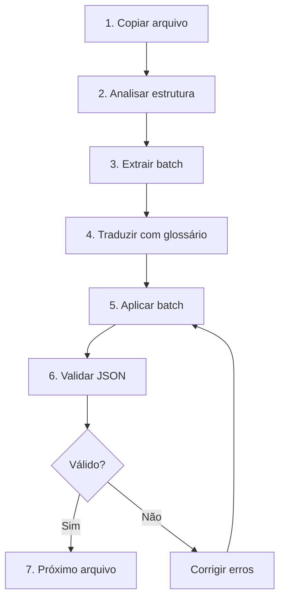

# Imperial Batch Workflow Skill

Skill para gerenciamento do workflow de tradução em lotes no Imperial Commander 2.

---

## 📁 Scripts Disponíveis

| Script | Localização | Uso |
|--------|-------------|-----|
| `copy_tutorials_to_br.py` | `WORK/scripts/` | Copia tutoriais En→Br |
| `copy_missiontext_to_br.py` | `WORK/scripts/` | Copia MissionText En→Br |
| `copy_missions_to_br.py` | `WORK/scripts/` | Copia missões com sufixo _BR |
| `translate_mission.py` | `WORK/scripts/` | Análise de estrutura JSON |
| `extract_batch_universal.py` | `WORK/scripts/` | Extrai lotes para tradução |
| `apply_batch_universal.py` | `WORK/scripts/` | Aplica traduções |
| `translate_txt.py` | `WORK/scripts/` | Análise de arquivos TXT |

---

## 🔄 Workflow de Tradução



---

## 📝 Comandos Passo a Passo

### 1. Copiar Arquivo (se necessário)

```bash
# Tutoriais
python WORK/scripts/copy_tutorials_to_br.py

# MissionText
python WORK/scripts/copy_missiontext_to_br.py

# Missões
python WORK/scripts/copy_missions_to_br.py
```

---

### 2. Analisar Estrutura

```bash
python WORK/scripts/translate_mission.py --list-keys <arquivo.json>
```

Campos traduzíveis típicos:
```
missionDescription, additionalMissionInfo, startingObjective, missionInfo,
theText, eventText, choiceText, buttonText, customInstructions,
descriptionText, bonusText, imperialRewardText, rebelsRewardText,
effects, eventFlavor, content, helpText, instruction, subname, text
```

---

### 3. Extrair Batch

```bash
# Extrair primeiro lote
python WORK/scripts/extract_batch_universal.py <arquivo.json> 1

# Extrair lote específico
python WORK/scripts/extract_batch_universal.py <arquivo.json> 3
```

---

### 4. Traduzir

Aplicar regras de tradução:
1. Verificar `lista_de_preservacao`
2. Consultar `glossario_de_traducao`
3. Usar `manual.txt` para contexto
4. Preservar tags, variáveis, escapes

---

### 5. Aplicar Batch

```bash
python WORK/scripts/apply_batch_universal.py <arquivo.json> <batch_traduzido.json>
```

---

### 6. Validar

```bash
# Validar JSON
python -m json.tool <arquivo.json> > /dev/null && echo "✅ JSON válido" || echo "❌ JSON inválido"

# Verificar languageID
grep '"languageID"' <arquivo.json>

# Verificar variáveis preservadas
grep -oE '\{[^}]+\}' <arquivo.json> | sort | uniq -c
```

---

## 📋 Metadados a Atualizar

Após traduzir, sempre atualizar:

```json
{
  "languageID": "Portuguese Brazilian (BR)",
  "saveDate": "4/26/2024"
}
```

---

## 🗂️ Estrutura de Diretórios

### Origem (EN)
```
ImperialCommander2/Assets/Resources/
├── SagaTutorials/En/           # Tutoriais
├── SagaMissions/               # Missões (por expansão)
└── Languages/En/               # Textos do sistema
    ├── DeploymentGroups/
    ├── MissionCardText/
    ├── MissionText/
    ├── bonuseffects.json
    ├── events.json
    ├── help.json
    ├── instructions.json
    └── ui.json
```

### Destino (BR)
```
ImperialCommander2/Assets/Resources/
├── SagaTutorials/Br/           # Tutoriais traduzidos
└── Languages/Br/               # Textos traduzidos
    ├── DeploymentGroups/
    ├── MissionCardText/
    ├── MissionText/
    ├── Missions/               # Missões com sufixo _BR
    ├── bonuseffects.json
    ├── events.json
    ├── help.json
    ├── instructions.json
    └── ui.json
```

---

## ✅ Checklist por Fase

### Fase 0: Arquivos Base (16 arquivos)
- [ ] Copiar Languages/En → Languages/Br
- [ ] DeploymentGroups (allies, enemies, villains)
- [ ] MissionCardText (8 arquivos)
- [ ] bonuseffects, events, help, instructions, ui

### Fase 1: Tutoriais (3 arquivos)
- [ ] TUTORIAL01.json
- [ ] TUTORIAL02.json
- [ ] TUTORIAL03.json

### Fase 2: MissionText (276 arquivos)
- [ ] Copiar todos os .txt
- [ ] Traduzir em lotes

### Fase 3: Missões Core (32 arquivos)
- [ ] CORE1 a CORE32 com sufixo _BR

### Fase 4: Expansões (106 arquivos)
- [ ] Jabba, Hoth, Empire (P1)
- [ ] Lothal, Twin, Bespin (P2)
- [ ] Other (P3)

---

## ⚠️ Dicas Importantes

1. **Sempre valide JSON** após cada alteração
2. **Faça backup** antes de aplicar traduções
3. **Trabalhe em lotes pequenos** para facilitar revisão
4. **Use dry-run** quando disponível nos scripts
5. **Consulte manual.txt** para termos ambíguos
