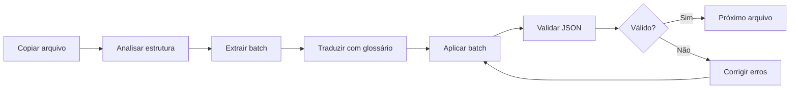

# Plano de Execução: Tradução Imperial Commander 2 → PT-BR

> **Versão:** 1.0  
> **Criado:** 2026-01-23  
> **PRD:** [PRD.md](file:///home/pgmadmin/BG/ImperialCommander2/WORK/PRD.md)

---

## Visão Geral

Tradução completa do Imperial Commander 2 (companion app para Star Wars: Imperial Assault) do inglês para português brasileiro, incluindo tutoriais, textos de missão e arquivos de missão.

---

## Inventário de Arquivos

| Tipo | Quantidade | Origem | Destino |
|------|:----------:|--------|---------|
| Tutoriais | **3** | `SagaTutorials/En/*.json` | `SagaTutorials/Br/*.json` |
| MissionText | **276** | `Languages/En/MissionText/*.txt` | `Languages/Br/MissionText/*.txt` |
| Missões | **138** | `SagaMissions/**/*.json` | `Languages/Br/Missions/**/*_BR.json` |

### Detalhamento de Missões

| Expansão | Arquivos | Prioridade |
|----------|:--------:|:----------:|
| Core | 32 | P0 |
| Jabba | 16 | P1 |
| Hoth | 16 | P1 |
| Empire | 16 | P1 |
| Lothal | 6 | P2 |
| Twin | 6 | P2 |
| Bespin | 6 | P2 |
| Other | 40 | P3 |

---

## Recursos Disponíveis

| Recurso | Localização | Status |
|---------|-------------|:------:|
| Dicionário/Glossário | `WORK/dicionarios/dicionario.json` | ✅ |
| Manual de Contexto | `WORK/manual.txt` (125KB) | ✅ |
| Scripts de Cópia | `WORK/scripts/copy_*.py` | ✅ |
| Scripts de Tradução | `WORK/scripts/translate_*.py` | ✅ |
| Scripts de Lote | `WORK/scripts/*_batch_*.py` | ✅ |

---

## Fases de Execução

### ▶️ Fase 0: Arquivos Base do Sistema — P0

**Passo 1: Copiar diretório base**
```bash
cp -r Languages/En Languages/Br
```

**Passo 2: Traduzir arquivos do sistema**

> [!IMPORTANT]
> **OBRIGATÓRIO:** Usar o workflow `/translate_imperial` para cada arquivo.
> Isso garante o uso dos scripts `extract_batch` e `apply_batch` para proteção de dados.

| Tarefa | Arquivo | Comando | Notas |
|:------:|---------|---------|-------|
| 0.1 | `DeploymentGroups/allies.json` | `/translate_imperial` | Traduzir descrições |
| 0.2 | `DeploymentGroups/enemies.json` | `/translate_imperial` | Traduzir descrições |
| 0.3 | `DeploymentGroups/villains.json` | `/translate_imperial` | Traduzir descrições |
| 0.4 | `MissionCardText/core.json` | `/translate_imperial` | Textos de cartas |
| 0.5 | `MissionCardText/bespin.json` | `/translate_imperial` | Textos de cartas |
| 0.6 | `MissionCardText/empire.json` | `/translate_imperial` | Textos de cartas |
| 0.7 | `MissionCardText/hoth.json` | `/translate_imperial` | Textos de cartas |
| 0.8 | `MissionCardText/jabba.json` | `/translate_imperial` | Textos de cartas |
| 0.9 | `MissionCardText/lothal.json` | `/translate_imperial` | Textos de cartas |
| 0.10 | `MissionCardText/other.json` | `/translate_imperial` | Textos de cartas |
| 0.11 | `MissionCardText/twin.json` | `/translate_imperial` | Textos de cartas |
| 0.12 | `bonuseffects.json` | `/translate_imperial` | ⚠️ Manter nomes EN |
| 0.13 | `events.json` | `/translate_imperial` | Traduzir descrições |
| 0.14 | `help.json` | `/translate_imperial` | Textos de ajuda |
| 0.15 | `instructions.json` | `/translate_imperial` | Traduzir instruções |
| 0.16 | `ui.json` | `/translate_imperial` | Traduzir textos da UI |


> [!WARNING]
> Em `bonuseffects.json`, manter o nome da habilidade em inglês antes dos dois pontos.
> Exemplo: `"CHARGING UP: Depois que esta figura atacar..."` ✅

**Total Fase 0:** 16 arquivos

---

### ▶️ Fase 1: Tutoriais (3 arquivos) — P0

```bash
cd /home/pgmadmin/BG/ImperialCommander2/WORK/scripts
python copy_tutorials_to_br.py
```

| Tarefa | Arquivo | INPUT → OUTPUT → VERIFY |
|--------|---------|-------------------------|
| 1.1 | `TUTORIAL01.json` | En/TUTORIAL01.json → Br/TUTORIAL01.json → JSON válido + languageID atualizado |
| 1.2 | `TUTORIAL02.json` | En/TUTORIAL02.json → Br/TUTORIAL02.json → JSON válido + languageID atualizado |
| 1.3 | `TUTORIAL03.json` | En/TUTORIAL03.json → Br/TUTORIAL03.json → JSON válido + languageID atualizado |

**Processo por arquivo:**
1. Copiar arquivo para `Br/`
2. Traduzir campos: `theText`, `eventText`, `buttonText`, `missionDescription`
3. Atualizar `languageID` → `"Portuguese Brazilian (BR)"`
4. Atualizar `saveDate` → Data atual
5. Validar JSON
6. Verificar tags/variáveis intactas

---

### ▶️ Fase 2: MissionText (276 arquivos) — P0

```bash
python copy_missiontext_to_br.py
```

| Tarefa | Descrição | INPUT → OUTPUT → VERIFY |
|--------|-----------|-------------------------|
| 2.1 | Copiar todos os `.txt` | En/MissionText/*.txt → Br/MissionText/*.txt |
| 2.2 | Traduzir em lotes | Agrupar por expansão, traduzir 10 arquivos por vez |
| 2.3 | Validar | Verificar encoding UTF-8, tags preservadas |

**Processo:**
1. Executar script de cópia
2. Usar `translate_txt.py --analyze` para entender estrutura
3. Traduzir respeitando glossário e lista de preservação
4. Manter tags `<>`, variáveis `{}`, escapes `\n`

---

### ▶️ Fase 3: Missões Core (32 arquivos) — P0

```bash
python copy_missions_to_br.py
```

| Tarefa | Arquivos | INPUT → OUTPUT → VERIFY |
|--------|----------|-------------------------|
| 3.1 | CORE1 a CORE8 | SagaMissions/Core/*.json → Languages/Br/Missions/Core/*_BR.json |
| 3.2 | CORE9 a CORE16 | Continuar tradução validando cada arquivo |
| 3.3-4 | CORE17 a CORE32 | Completar Core com verificação final |

**Campos a traduzir:**
```
missionDescription, additionalMissionInfo, startingObjective, missionInfo,
theText, eventText, choiceText, buttonText, customInstructions,
descriptionText, bonusText, imperialRewardText, rebelsRewardText,
effects, eventFlavor, content, helpText, instruction, subname, text
```

---

### ▶️ Fase 4: Expansões Secundárias — P1/P2

| Fase | Expansão | Arquivos | Estimativa |
|:----:|----------|:--------:|------------|
| 4.1 | Jabba | 16 | 1-2 sessões |
| 4.2 | Hoth | 16 | 1-2 sessões |
| 4.3 | Empire | 16 | 1-2 sessões |
| 4.4 | Other | 40 | 2-3 sessões |
| 4.5 | Lothal | 6 | 1 sessão |
| 4.6 | Twin | 6 | 1 sessão |
| 4.7 | Bespin | 6 | 1 sessão |

---

## Workflow de Tradução por Arquivo



**Comandos úteis:**
```bash
# Analisar JSON
python translate_mission.py --list-keys <arquivo.json>

# Extrair lote para tradução
python extract_batch_universal.py <arquivo.json> [numero_lote]

# Aplicar tradução
python apply_batch_universal.py <arquivo.json> <batch_traduzido.json>

# Analisar TXT
python translate_txt.py --analyze <arquivo.txt>
```

---

## Regras de Tradução

### Hierarquia de Decisão

| Prioridade | Verificação | Ação |
|:----------:|-------------|------|
| 1 | Termo em `lista_de_preservacao`? | 🔒 Manter inglês |
| 2 | Termo em `glossario_de_traducao`? | 📖 Usar tradução exata |
| 3 | Contexto em `manual.txt`? | 🌐 Desambiguação contextual |

### Elementos NUNCA Traduzir

| Tipo | Exemplo | Regex de Proteção |
|------|---------|-------------------|
| Variáveis | `{amount}`, `{hero}` | `\{[^}]+\}` |
| Tags | `<red>`, `</b_blue>` | `<[^>]+>` |
| Escapes | `\n`, `\r` | `\\[nr]` |

---

## Verificação

### Validação Automática (por arquivo)

```bash
# Validar JSON
python -m json.tool <arquivo.json> > /dev/null && echo "✅ JSON válido"

# Verificar languageID
grep -q '"languageID": "Portuguese Brazilian (BR)"' <arquivo.json> && echo "✅ languageID OK"

# Contar variáveis preservadas (antes vs depois)
grep -oE '\{[^}]+\}' <arquivo_original.json> | sort | uniq -c > vars_orig.txt
grep -oE '\{[^}]+\}' <arquivo_traduzido.json> | sort | uniq -c > vars_trad.txt
diff vars_orig.txt vars_trad.txt
```

### Verificação Manual

1. Carregar missão no aplicativo Imperial Commander 2
2. Verificar renderização correta de texto
3. Testar interações de botão
4. Confirmar que variáveis são substituídas corretamente

---

## Critérios de Aceitação

- [ ] Arquivos base do sistema (16) traduzidos
- [ ] Nomes de habilidades preservados em bonuseffects.json
- [ ] Todos os tutoriais (3) traduzidos e funcionais
- [ ] Todos os MissionText (276) traduzidos
- [ ] Todas as missões Core (32) traduzidas com sufixo `_BR`
- [ ] JSON válido após cada tradução
- [ ] Tags e variáveis intactas
- [ ] Glossário aplicado 100%
- [ ] Termos preservados em inglês conforme lista

---

## Riscos e Mitigações

| Risco | Probabilidade | Impacto | Mitigação |
|-------|:-------------:|:-------:|-----------|
| JSON quebrado | Média | Alto | Validação após cada lote |
| Termo preservado traduzido | Baixa | Médio | Verificação automática com regex |
| Inconsistência terminológica | Média | Médio | Uso estrito do glossário |
| Perda de variáveis | Baixa | Alto | Diff antes/depois |

---

## Estimativa de Tempo

| Fase | Arquivos | Tempo Estimado |
|------|:--------:|----------------|
| Fase 0 | 16 | 4-6 horas |
| Fase 1 | 3 | 2-3 horas |
| Fase 2 | 276 | 8-12 horas |
| Fase 3 | 32 | 6-8 horas |
| Fase 4 | 106 | 12-16 horas |
| **Total** | **433** | **~35-45 horas** |

---

## Próximos Passos

1. ✅ Plano criado
2. ⏳ Aguardando aprovação do usuário
3. 🔜 Iniciar Fase 0: Arquivos Base do Sistema
4. 🔜 Executar Fase 1: Tutoriais

---

## Phase X: Checklist de Verificação Final

- [ ] Todos os arquivos `.json` são válidos
- [ ] `languageID` atualizado em todos os arquivos
- [ ] Nenhuma variável `{}` foi alterada
- [ ] Nenhuma tag `<>` foi alterada
- [ ] Glossário aplicado consistentemente
- [ ] Lista de preservação respeitada
- [ ] Testes de carregamento no app passam
