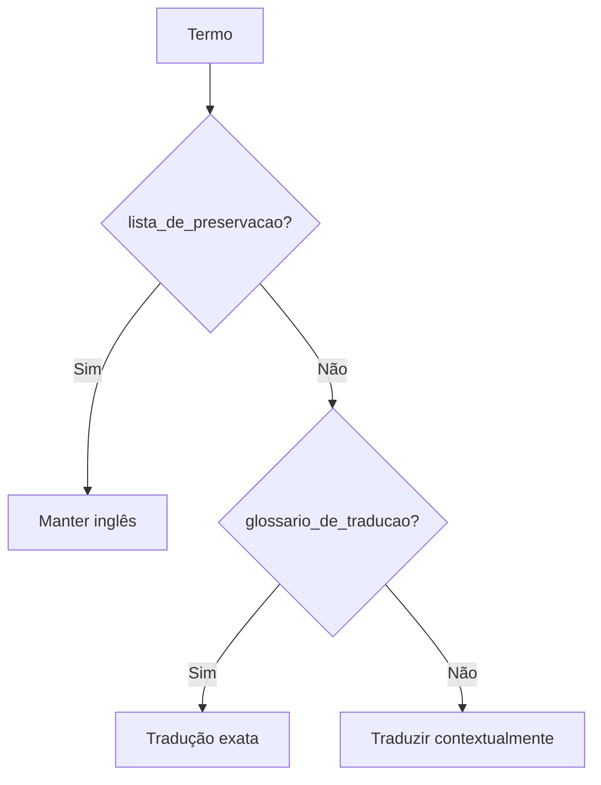

# PRD: Tradução Imperial Commander 2 → PT-BR

## Problem Statement
O Imperial Commander 2 (companion app para Star Wars: Imperial Assault) não possui localização em Português do Brasil, limitando o acesso de jogadores brasileiros.

## Target Audience
- **Primário:** Jogadores brasileiros de Imperial Assault
- **Secundário:** Comunidade lusófona de board games

---

## User Stories

| ID | História | Prioridade |
|----|----------|------------|
| US1 | Como jogador BR, quero jogar tutoriais em português | P0 |
| US2 | Como jogador BR, quero ler textos de missão em português | P0 |
| US3 | Como jogador BR, quero termos técnicos consistentes | P1 |

---

## Estrutura de Diretórios

| Tipo | Origem | Destino |
|------|--------|---------|
| Tutoriais | `SagaTutorials/En/*.json` | `SagaTutorials/Br/*.json` |
| MissionText | `Languages/En/MissionText/*.txt` | `Languages/Br/MissionText/*.txt` |
| Missões | `SagaMissions/**/*.json` | `Languages/Br/Missions/**/*_BR.json` |

---

## Hierarquia de Decisão



| Prioridade | Fonte | Ação |
|------------|-------|------|
| 1 | `dicionario.json → lista_de_preservacao` | Manter inglês |
| 2 | `dicionario.json → glossario_de_traducao` | Usar tradução exata |
| 3 | `manual.txt` | Desambiguação contextual |

---

## Chaves JSON Traduzíveis

```
missionDescription, additionalMissionInfo, startingObjective, missionInfo,
theText, eventText, choiceText, buttonText, customInstructions,
descriptionText, bonusText, imperialRewardText, rebelsRewardText,
effects, eventFlavor, content, helpText, instruction, subname, text
```

### Metadados a Atualizar
- `languageID` → `"Portuguese Brazilian (BR)"`
- `saveDate` → Data atual

---

## Regras de Integridade

| Tipo | Exemplo | Ação |
|------|---------|------|
| Variáveis | `{amount}`, `{hero}` | **NÃO** traduzir |
| Tags | `<red>`, `</b_blue>` | **NÃO** traduzir |
| Escapes | `\n`, `\r` | **NÃO** traduzir |

---

## Fases de Execução

> **Diretriz:** Traduzir arquivo por arquivo, validar antes de prosseguir.

### Fase 1: Tutoriais (3 arquivos)
1. `python copy_tutorials_to_br.py`
2. Traduzir: `TUTORIAL01.json`, `TUTORIAL02.json`, `TUTORIAL03.json`

### Fase 2: MissionText (~276 arquivos)
1. `python copy_missiontext_to_br.py`
2. Traduzir cada `*.txt`

### Fase 3: Missões Core (32 arquivos)
1. `python copy_missions_to_br.py` (sufixo `_BR`)
2. Traduzir `CORE1_BR.json` até `CORE16_BR.json`

### Fase 4: Outras Expansões
Bespin (6), Empire (16), Hoth (16), Jabba (16), Lothal (6), Twin (6), Other (40)

---

## Scripts Disponíveis

| Script | Uso |
|--------|-----|
| `copy_tutorials_to_br.py` | Copia tutoriais En→Br |
| `copy_missiontext_to_br.py` | Copia MissionText En→Br |
| `copy_missions_to_br.py` | Copia missões com _BR |
| `translate_mission.py --list-keys <json>` | Análise JSON |
| `extract_batch_universal.py <json> [lote]` | Extração lotes |
| `apply_batch_universal.py <json> <batch>` | Aplicação |
| `translate_txt.py --analyze <txt>` | Análise TXT |

---

## Acceptance Criteria

- [ ] Todos os tutoriais traduzidos e funcionais
- [ ] Todos os MissionText traduzidos
- [ ] Todas as missões Core traduzidas com sufixo _BR
- [ ] JSON válido após cada tradução
- [ ] Tags e variáveis intactas
- [ ] Glossário aplicado 100%
- [ ] Termos preservados em inglês

---

## Out of Scope

- Tradução de áudio
- Tradução de imagens/texturas
- Alteração de mecânicas de jogo
- Línguas além de PT-BR

---

## Riscos

| Risco | Mitigação |
|-------|-----------|
| JSON quebrado | Validação após cada lote |
| Termo preservado traduzido | Verificação automática |
| Inconsistência | Uso estrito do glossário |

---

*Atualizado: 2026-01-23*
